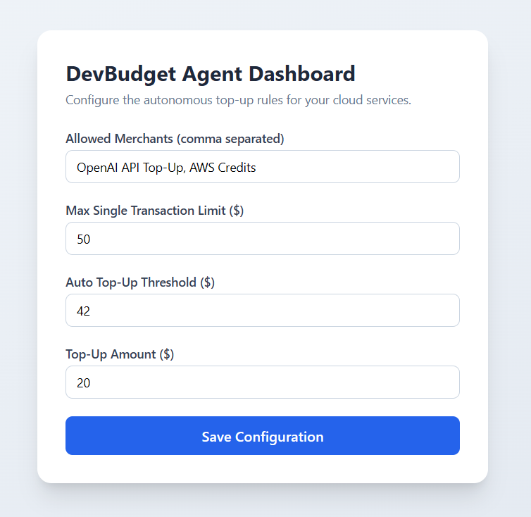
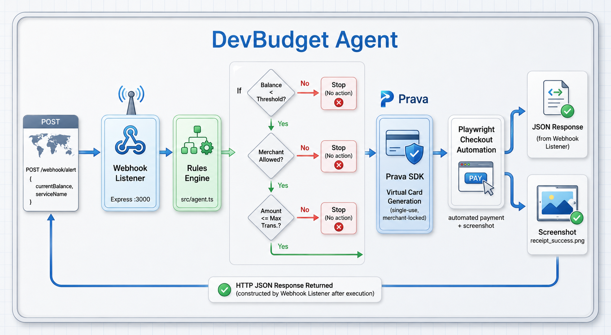

# 💳 DevBudget Agent

> **An autonomous agent that keeps your cloud credits topped up — so a $1.50 balance can never break production at 3 AM.**

DevBudget Agent listens for low-balance alerts from services like **OpenAI**, **AWS**, and **Vercel**, evaluates them against configurable spending rules, and—when approved—autonomously generates a **single-use virtual card via the Prava API** before completing the credit purchase using **Playwright**.

---

## 🚨 The Problem

Cloud services don't care what time it is. When API credits or cloud balances run out unexpectedly, applications fail immediately.

Common scenarios include:

- ❌ OpenAI returns `429` or `insufficient_quota`
- ❌ AWS credits are exhausted unexpectedly
- ❌ Vercel usage reaches billing limits
- ❌ A developer is forced to wake up at **3 AM** just to approve a **$20** payment
- ❌ Manual top-up workflows introduce unnecessary downtime

---

## 💡 The Solution

Instead of waking up an engineer, DevBudget Agent acts as an autonomous financial operator:

1. Receives a low-balance webhook.
2. Evaluates configurable spending rules.
3. Verifies merchant and transaction limits.
4. Creates a merchant-locked, single-use virtual card using the **Prava API**.
5. Uses **Playwright** to autonomously complete the payment.
6. Captures proof of a successful checkout.

**Zero manual intervention required.**

---

## 🎛️ Dashboard

Configure spending policies in real time through the web dashboard.



The dashboard allows you to safely manage:

- Balance thresholds
- Maximum transaction amounts
- Merchant allowlists
- Auto top-up toggles

---

## 🏛️ System Architecture



| Layer | Technology | Responsibility |
| :--- | :--- | :--- |
| **Web Dashboard** | HTML, JavaScript, Express | Manage spending rules in real time |
| **Webhook Listener** | Express 5 | Receives low-balance alerts |
| **Rules Engine** | TypeScript | Validates thresholds, allowlists, and limits |
| **Prava Service** | Axios | Generates single-use virtual cards |
| **Checkout Automator** | Playwright | Completes payment and captures a receipt |

---

## 🔄 Workflow

```text
Cloud Provider
      │
      ▼
Low Balance Webhook
      │
      ▼
Webhook Listener
      │
      ▼
Rules Engine
      │
      ├── ❌ Rules Failed → Stop Process
      │
      └── ✅ Rules Passed
               │
               ▼
      Generate Prava Virtual Card
               │
               ▼
     Playwright Checkout Automation
               │
               ▼
        Payment Successful
               │
               ▼
     Receipt Screenshot Saved
```

---

## 🛡️ Safety & Guardrails (Zero-Trust Spending)

DevBudget follows a strict zero-trust spending model to ensure funds are never misused.

- ✅ **Single-use cards** — Every transaction receives a brand-new virtual card that expires immediately after use.
- ✅ **Merchant lock** — Cards are restricted to a single approved merchant.
- ✅ **Spending limit** — Each card is capped at exactly the approved transaction amount.
- ✅ **Rules before money** — No virtual card is generated until every configured rule has been validated.

---

## 📂 Project Structure

```text
devbudget-agent/
├── public/
│   └── index.html                 # Web Dashboard UI
├── src/
│   ├── server.ts                  # Express webhook server
│   ├── agent.ts                   # Agent orchestration logic
│   ├── automators/
│   │   └── checkoutAutomator.ts   # Playwright automation
│   ├── config/
│   │   └── rules.json             # Spending rules configuration
│   └── services/
│       └── pravaService.ts        # Prava API integration
├── docs/
│   ├── architecture.png
│   └── dashboard.png
├── demo.ts                        # Demo webhook sender
├── .env
├── package.json
└── README.md
```

---

## ▶️ Getting Started

### Prerequisites

- Node.js **18+**
- npm
- Playwright (installed automatically if required)

---

### 1. Clone the Repository

```bash
git clone https://github.com/your-username/devbudget-agent.git
cd devbudget-agent
```

---

### 2. Install Dependencies

```bash
npm install
```

---

### 3. Configure Environment Variables

Create a `.env` file in the project root.

```env
PRAVA_API_KEY=pv_test_mock_key_12345
PRAVA_ENVIRONMENT=sandbox
```

---

### 4. Start the Web Server

```bash
npm run start:webhook
```

Open your browser:

```
http://localhost:3000
```

Configure your spending rules using the dashboard.

---

### 5. Run the Autonomous Demo

Open a second terminal and run:

```bash
npm run demo
```

The demo will:

- Trigger a mock low-balance alert
- Validate dashboard rules
- Generate a Prava virtual card
- Launch Chromium with Playwright
- Complete the payment automatically
- Save a checkout receipt screenshot

---

## ⚙️ Example Webhook Payload

```http
POST /webhook/alert
Content-Type: application/json
```

```json
{
  "serviceName": "OpenAI",
  "currentBalance": 1.50
}
```

---

## 🚀 Future Improvements

- Multi-provider alert support
- Slack and Discord notifications
- Transaction history and audit dashboard
- Human approval workflow for high-value purchases
- Docker containerization
- Kubernetes deployment
- Email receipts
- Spending analytics

---

## ⚠️ Disclaimer

This project is intended as a demonstration of autonomous payment orchestration using virtual cards.

For production deployments, always:

- Secure API credentials
- Enable authentication
- Validate webhook signatures
- Audit every transaction
- Follow your organization's financial policies

---

## 📄 License

MIT License

---

Built with ❤️ to ensure your infrastructure never stops because someone forgot to click **"Add Credits."**
